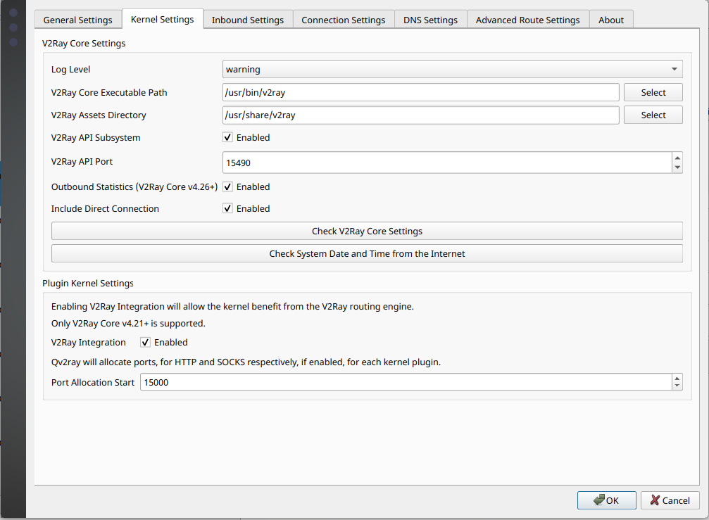
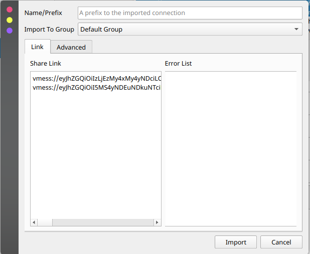

## مراحل نصب 
اول از همه از طریق لینک های زیر اپلیکیشن QV2ray رو متناسب با سستم عاملتون دانلود کنید بعد از اون به ابزار دیگه به اسم v2ray-core هم نیاز داریم که در واقع هسته اصلی هست و QV2ray با اون کار میکنه . 

- [Download for Windows](https://github.com/Qv2ray/Qv2ray/releases/download/v2.7.0/Qv2ray-v2.7.0-Windows-Installer.exe) 
- [Download for Mac](https://github.com/Qv2ray/Qv2ray/releases/download/v2.7.0/Qv2ray-v2.7.0-macOS-x64.dmg)
- [Downlaod for Linux](https://github.com/Qv2ray/Qv2ray/releases/download/v2.7.0/Qv2ray-v2.7.0-linux-x64.AppImage)

برای دانلود v2ray-core هم از لینک زیر استفاده کنید کسایی که از آرچ لینوکس استفاده می کنن باید بتونن از AUR نصبش کنن. در غیر اینصورت باید ریلیز متناسب با سیستم عامل و معماری رو دانلود کنید و از حالت فشرده خارج کنید. 

- [Download latest V2ray-core](https://github.com/v2fly/v2ray-core/releases/)

داخل آرشیو یک فایل اجرایی به اسم v2ray هست در توزیع های لینوکسی نیاز هست که به فایل قابلیت اجرایی بدین . 
ظاهرا آخرین ورژن v2ray-core با qv2ray همخوانی نداره از اونجایی که توسعه اش متوقف شده این مسئله به نظر عادی میاد یکی از دوستان ورژن قدیمی تری از v2ray-core رو امتحان کردن و اوکی بوده 

-[Download v4.31.0 V2ray-core](https://github.com/v2fly/v2ray-core/releases/tag/v4.31.0)

[go to issue](https://github.com/HarlyquinForest/our-time-is-now/issues/1)

`` chmod +x v2ray ``

 اگر در لینوکس هستید می تونید با اضافه کردن فایل اجرایی به مسیر /usr/bin و یا /usr/local/bin در ترمینال فارغ از مسیر جاری استفاده کنید البته به یک پوشه دیگه به نام asset احتیاج دارید که فایل های با پسوند dat رو درونش قرار بدید که می تونید در این مسیرها قرارش بدید /usr/loca/share/v2ray و یا /usr/share/v2ray
بعد از اون نیاز هست که این ابزار رو داخل برنامه Qv2ray بهش معرفی کنید مطابق تصویر زیر

حالا می تونید تو صفحه اصلی برنامه سرور های مورد نظر رو ایمپورت کنید معمول ترین روشش استفاده از Share Link هست که داخل این ریپو هم با این روش سرورهارو در اختیارتون میزاریم. می تونید چندین لینکو رو همزمان اضافه کنید 

در تظیمات برنامه و قسمت Inbound Settings حتما گزینه HTTP Settings رو فعال کنید و تیک Set System Proxy هم فعال باشه که به صورت خودکار پروکسی های مورد نیاز رو برای سیستم عاملتون ست کنه و در مرورگر هم گزینه متناظرو فعال کنید. 

راستش با عجله نوشتم اگر جایی مشکل داشتید یا اشتباه بود هم می تونید issue باز کنید تو گیت هاب و یا گروه مطرح کنید. : )‌
